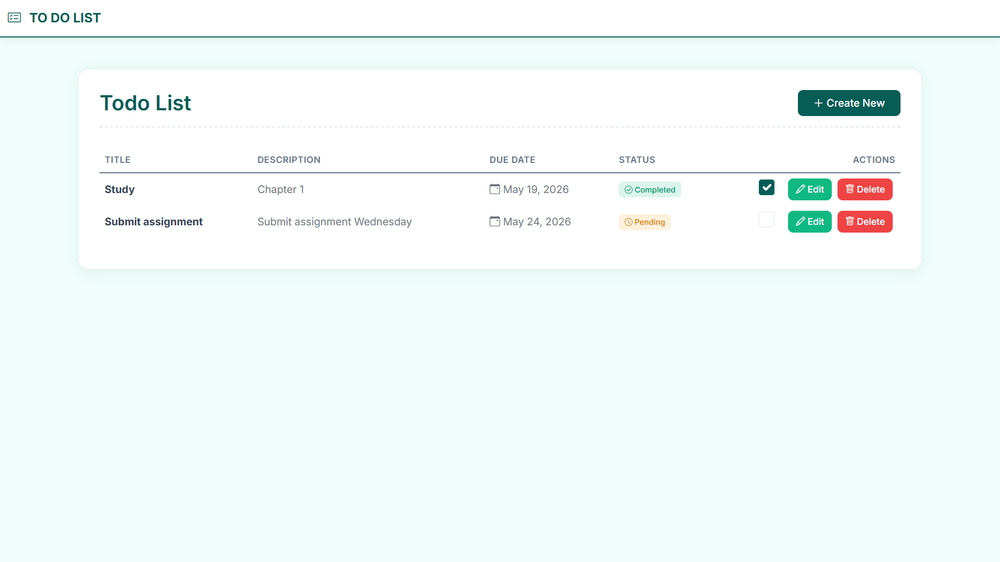
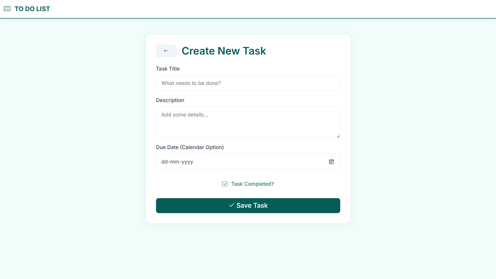
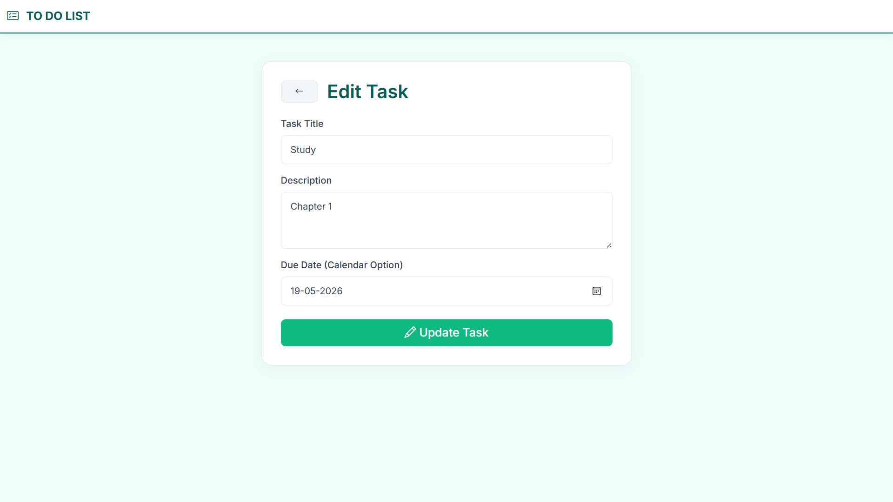
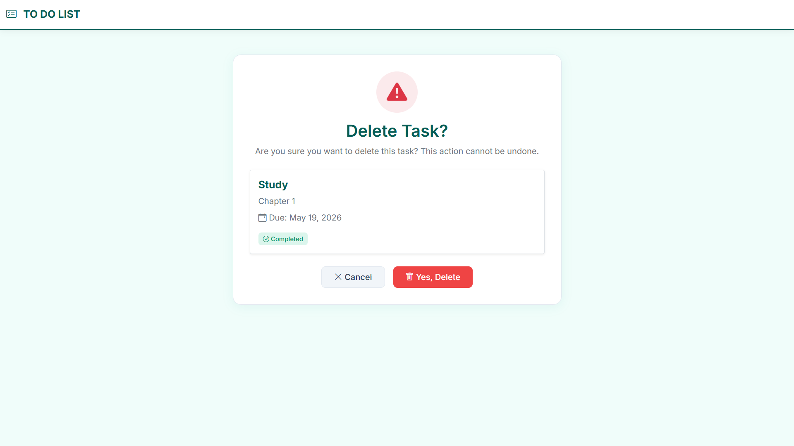

# ASP.NET Core MVC Todo App using Entity Framework Core

This is a simple Todo Management Application built using:

* ASP.NET Core MVC
* Entity Framework Core (EF Core)
* SQL Server

The application performs CRUD operations:

* Create Todo
* Read Todo
* Update Todo
* Delete Todo

Entity Framework Core is used for database connection and data operations using the Code-First approach.

## Technologies Used

* ASP.NET Core MVC
* Entity Framework Core
* SQL Server
* Bootstrap

## Features

* Add new tasks
* Edit tasks
* Delete tasks
* Store data in SQL Server database
* EF Core migrations support

## Application Screenshot

